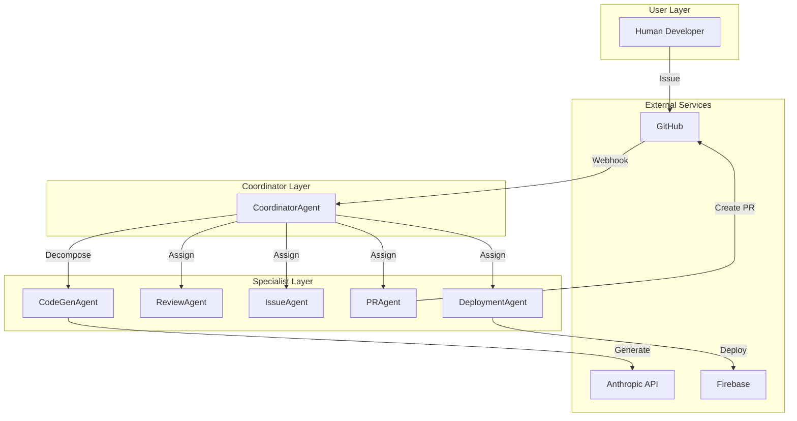
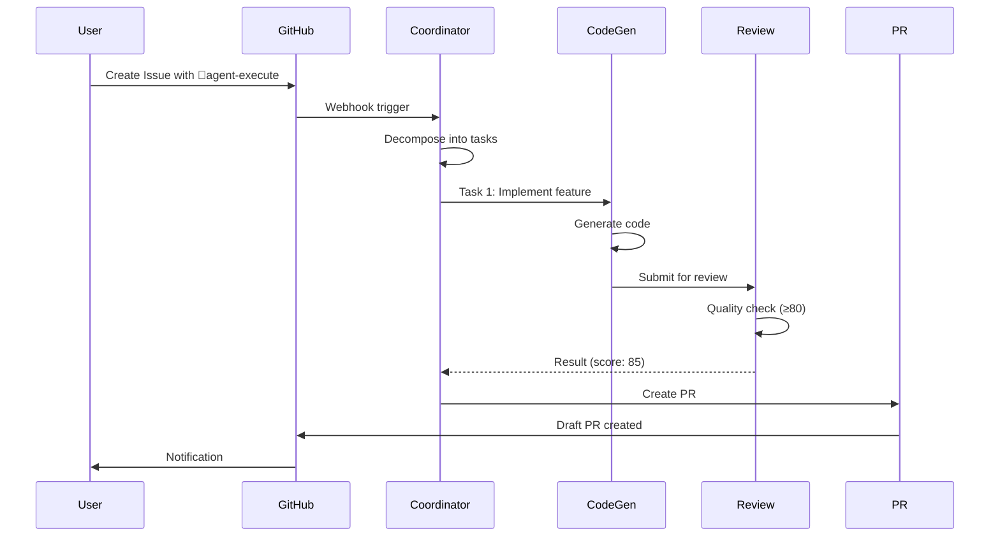
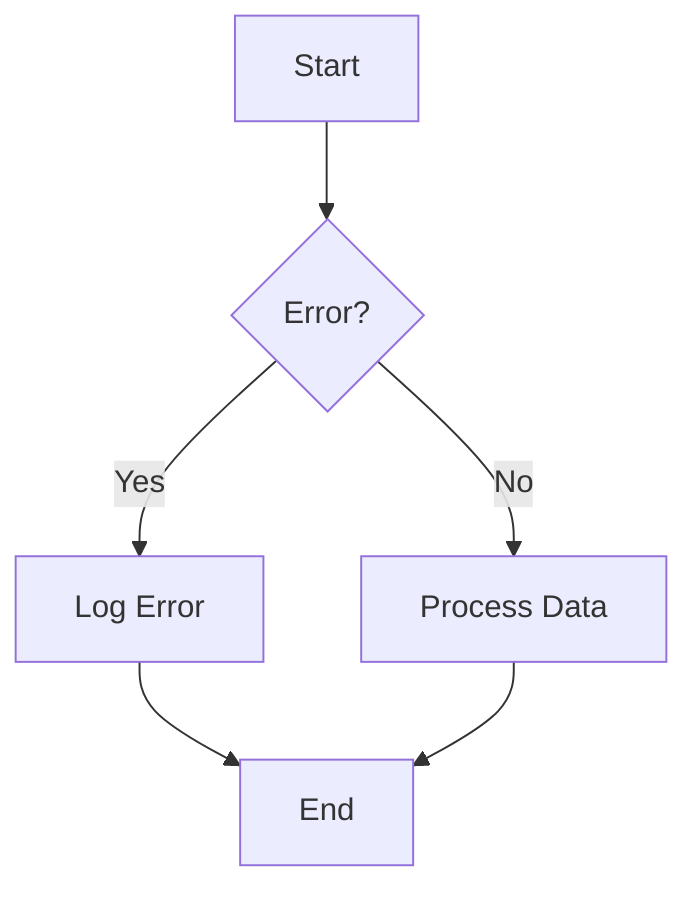
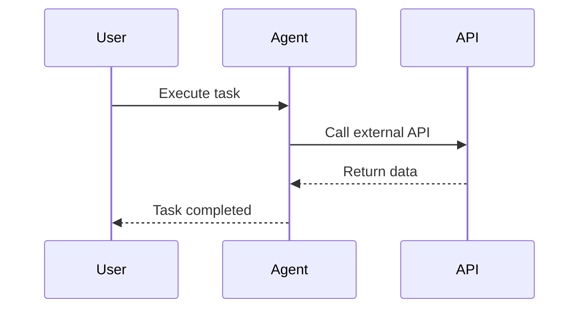
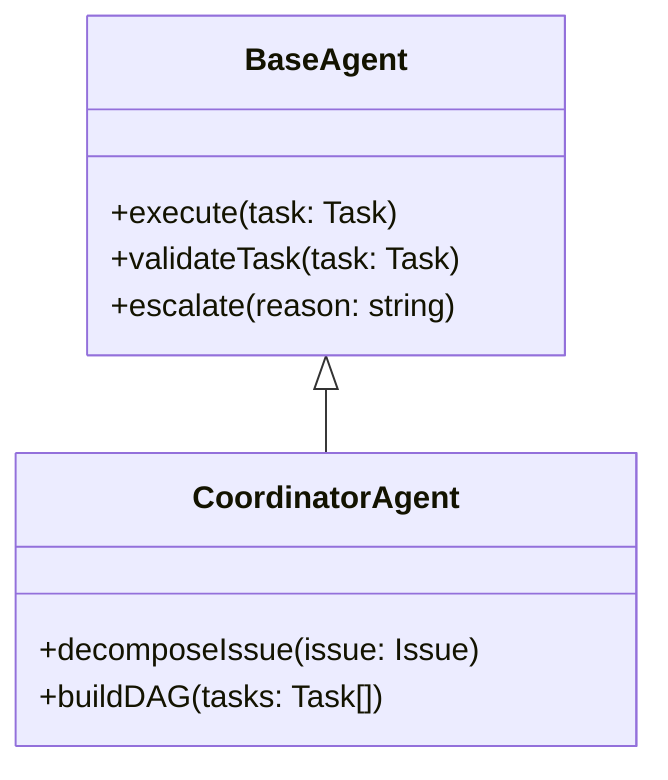
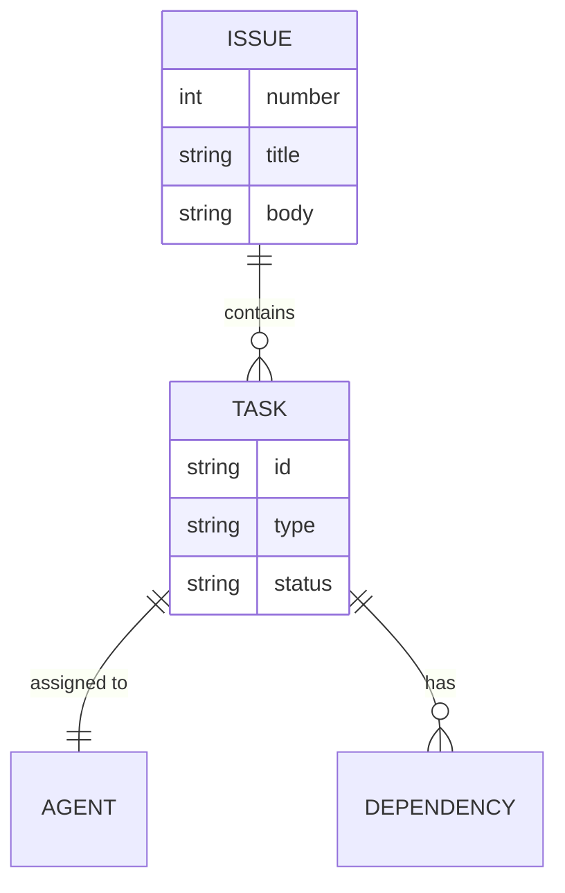
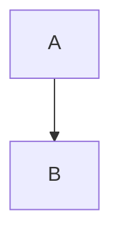

# Generate Docs Command

TypeScriptコードからAPIドキュメント、README、アーキテクチャ図を自動生成します。

## 使用方法

```bash
/generate-docs [type]
```

## パラメータ

- `type` (オプション): 生成するドキュメントタイプ
  - `all` (デフォルト): すべてのドキュメント生成
  - `api`: API リファレンス (TypeDoc)
  - `readme`: README.md 更新
  - `architecture`: アーキテクチャ図生成
  - `changelog`: CHANGELOG.md 生成

## 実行内容

### 1. API リファレンス生成 (TypeDoc)

```bash
npx typedoc --out docs/api src/
```

生成されるドキュメント:

```
docs/api/
├── index.html              # エントリーポイント
├── classes/
│   ├── BaseAgent.html
│   ├── CoordinatorAgent.html
│   └── CodeGenAgent.html
├── interfaces/
│   ├── Task.html
│   ├── AgentResult.html
│   └── QualityReport.html
├── modules/
│   └── types.html
└── assets/
    ├── style.css
    └── search.js
```

**アクセス**: `open docs/api/index.html`

### 2. README.md 自動更新

コードベースを分析し、README.mdを更新:

```markdown
# Project Name

## 📊 Project Stats

- **Total Files**: 234
- **Lines of Code**: 12,450
- **Test Coverage**: 85%
- **TypeScript**: 100%
- **Dependencies**: 258

## 🏗️ Architecture

<architecture-diagram>

## 📦 Modules

### Core Agents (agents/)

#### CoordinatorAgent
Orchestrates task decomposition and agent assignment.

**Methods**:
- `decomposeIssue(issue: Issue): Promise<TaskDecomposition>`
- `buildDAG(tasks: Task[]): Promise<DAG>`
- `assignAgent(task: Task): Promise<AgentType>`

**Dependencies**:
- Octokit (GitHub API)
- Anthropic SDK

#### CodeGenAgent
Generates code using Claude Sonnet 4.

**Methods**:
- `execute(task: Task): Promise<AgentResult>`
- `generateCode(spec: CodeSpec): Promise<GeneratedCode>`

...

## 📚 API Documentation

Full API documentation: [docs/api/](./docs/api/index.html)

## 🧪 Testing

```bash
npm test              # Run tests
npm run test:coverage # With coverage
```

## 📝 Contributing

See [CONTRIBUTING.md](./CONTRIBUTING.md)
```

### 3. アーキテクチャ図生成

Mermaid記法でアーキテクチャ図を生成:

#### システム構成図



#### データフロー図



### 4. CHANGELOG.md 生成

Git コミット履歴から自動生成:

```markdown
# Changelog

All notable changes to this project will be documented in this file.

The format is based on [Keep a Changelog](https://keepachangelog.com/en/1.0.0/),
and this project adheres to [Semantic Versioning](https://semver.org/spec/v2.0.0.html).

## [Unreleased]

### Added
- New feature: User profile editing (#123)
- Agent: DeploymentAgent auto-rollback

### Changed
- Updated lodash to 4.17.21 for security
- Improved CoordinatorAgent DAG algorithm

### Fixed
- Fixed: Login token refresh issue (#124)
- Fixed: Type errors in deployment config

### Security
- Patched XSS vulnerability in UserProfile component

## [1.2.0] - 2025-10-08

### Added
- Agent system implementation
- GitHub Actions integration
- Claude Code optimization

### Changed
- Migrated from JavaScript to TypeScript
- Updated testing framework to Vitest

## [1.1.0] - 2025-09-15

### Added
- Initial agent implementation
- Basic CI/CD pipeline

## [1.0.0] - 2025-09-01

### Added
- Initial release
- Core functionality
```

## 実行例

### Example 1: すべてのドキュメント生成

```bash
/generate-docs all
```

**出力**:

```
📚 Generate Docs - All

1. API Reference (TypeDoc)
   ⏳ Generating...
   ✅ docs/api/index.html
   📄 234 files documented
   🌐 Open: file:///path/to/docs/api/index.html

2. README.md Update
   ⏳ Analyzing codebase...
   ✅ README.md updated
   📊 Stats: 234 files, 12,450 LOC, 85% coverage

3. Architecture Diagrams
   ⏳ Generating Mermaid diagrams...
   ✅ docs/ARCHITECTURE.md
   📊 3 diagrams generated

4. CHANGELOG.md
   ⏳ Analyzing git history...
   ✅ CHANGELOG.md generated
   📝 25 commits processed

✅ Documentation Generated

📂 Output:
- docs/api/ (API Reference)
- README.md (Updated)
- docs/ARCHITECTURE.md (Diagrams)
- CHANGELOG.md (Generated)

🌐 View: open docs/api/index.html

Duration: 1m 23s
```

### Example 2: API ドキュメントのみ生成

```bash
/generate-docs api
```

**出力**:

```
📚 Generate Docs - API Reference

TypeDoc Configuration:
- Entry: src/
- Output: docs/api/
- Theme: default
- Include: README.md

⏳ Generating...

✅ Generated:
- 11 Classes
- 23 Interfaces
- 8 Modules
- 234 Files

📊 Coverage:
- Public APIs: 100%
- JSDoc Comments: 92%
- Examples: 78%

🌐 Open: file:///Users/shunsuke/Dev/Autonomous-Operations/docs/api/index.html

💡 Tip: Add more JSDoc examples for better documentation
```

### Example 3: CHANGELOG のみ生成

```bash
/generate-docs changelog
```

**出力**:

```
📚 Generate Docs - CHANGELOG

Git History Analysis:
- Commits: 125
- Date Range: 2025-09-01 to 2025-10-08
- Contributors: 3

⏳ Generating...

✅ CHANGELOG.md

📝 Releases:
- v1.2.0 (2025-10-08): 45 changes
- v1.1.0 (2025-09-15): 32 changes
- v1.0.0 (2025-09-01): 48 changes

📊 Change Types:
- Added: 18 features
- Changed: 12 improvements
- Fixed: 8 bugs
- Security: 2 patches

🔗 Format: Keep a Changelog

Duration: 12s
```

## TypeDoc 設定

### typedoc.json

```json
{
  "entryPoints": ["src/"],
  "out": "docs/api",
  "theme": "default",
  "exclude": [
    "**/node_modules/**",
    "**/tests/**",
    "**/*.test.ts"
  ],
  "excludePrivate": true,
  "excludeProtected": false,
  "includeVersion": true,
  "readme": "README.md",
  "plugin": ["typedoc-plugin-markdown"],
  "navigation": {
    "includeCategories": true,
    "includeGroups": true
  }
}
```

### package.json

```json
{
  "scripts": {
    "docs:api": "typedoc",
    "docs:serve": "npx http-server docs/api -p 8080 -o"
  },
  "devDependencies": {
    "typedoc": "^0.25.0",
    "typedoc-plugin-markdown": "^3.17.0"
  }
}
```

## JSDoc ベストプラクティス

### クラスのドキュメント

```typescript
/**
 * CoordinatorAgent orchestrates task decomposition and agent assignment.
 *
 * This agent analyzes GitHub Issues, decomposes them into actionable tasks,
 * builds a Directed Acyclic Graph (DAG) for dependency management, and
 * assigns appropriate specialist agents to each task.
 *
 * @example
 * ```typescript
 * const coordinator = new CoordinatorAgent(config);
 * const decomposition = await coordinator.decomposeIssue(issue);
 *
 * if (!decomposition.hasCycles) {
 *   for (const task of decomposition.tasks) {
 *     const agent = await coordinator.assignAgent(task);
 *     console.log(`Task ${task.id} → ${agent}`);
 *   }
 * }
 * ```
 *
 * @see {@link BaseAgent} for base functionality
 * @see {@link docs/AGENT_OPERATIONS_MANUAL.md} for operational details
 */
export class CoordinatorAgent extends BaseAgent {
  /**
   * Decomposes a GitHub Issue into actionable tasks with dependencies.
   *
   * Uses Claude Sonnet 4 to analyze the Issue description and extract:
   * - Individual tasks
   * - Dependencies between tasks
   * - Priority and complexity estimates
   *
   * @param issue - GitHub Issue object
   * @returns Task decomposition with DAG
   * @throws {Error} If Issue cannot be decomposed
   *
   * @example
   * ```typescript
   * const issue = await octokit.issues.get({ issue_number: 123 });
   * const decomposition = await coordinator.decomposeIssue(issue);
   *
   * console.log(`Tasks: ${decomposition.tasks.length}`);
   * console.log(`Has cycles: ${decomposition.hasCycles}`);
   * ```
   */
  async decomposeIssue(issue: Issue): Promise<TaskDecomposition> {
    // Implementation
  }
}
```

### インターフェースのドキュメント

```typescript
/**
 * Quality assessment report for generated code.
 *
 * Scoring system:
 * - Base score: 100
 * - ESLint errors: -20 each
 * - TypeScript errors: -30 each
 * - Critical vulnerabilities: -40 each
 *
 * Passing threshold: ≥80
 */
export interface QualityReport {
  /** Overall quality score (0-100) */
  score: number;

  /** Whether the code passes quality threshold */
  passed: boolean;

  /** Detailed breakdown of quality metrics */
  breakdown: {
    /** ESLint score component */
    eslintScore: number;

    /** TypeScript type safety score */
    typeScriptScore: number;

    /** Security vulnerability score */
    securityScore: number;

    /** Test coverage score */
    testCoverageScore: number;
  };

  /** List of identified quality issues */
  issues: QualityIssue[];

  /** Recommendations for improvement */
  recommendations: string[];
}
```

## Mermaid 図の種類

### 1. フローチャート



### 2. シーケンス図



### 3. クラス図



### 4. ER図



## CI/CD統合

### GitHub Actions で自動生成

```yaml
name: Generate Docs

on:
  push:
    branches: [main]
  workflow_dispatch:

jobs:
  generate-docs:
    runs-on: ubuntu-latest
    steps:
      - uses: actions/checkout@v3

      - name: Setup Node.js
        uses: actions/setup-node@v3
        with:
          node-version: '20'

      - name: Install dependencies
        run: npm ci

      - name: Generate API docs
        run: npm run docs:api

      - name: Deploy to GitHub Pages
        uses: peaceiris/actions-gh-pages@v3
        with:
          github_token: ${{ secrets.GITHUB_TOKEN }}
          publish_dir: ./docs/api
```

## トラブルシューティング

### Q1: TypeDoc がエラーを出す

```bash
# TypeDoc を最新版に更新
npm update typedoc

# キャッシュクリア
rm -rf node_modules/.cache
```

### Q2: Mermaid 図が表示されない

GitHub で Mermaid を表示するには、markdown ファイルに以下を追加:

````markdown

````

### Q3: CHANGELOG が空

```bash
# Conventional Commits形式を確認
git log --oneline

# feat:, fix: などの接頭辞が必要
```

## 関連ドキュメント

- [TypeDoc Documentation](https://typedoc.org/)
- [Mermaid Documentation](https://mermaid.js.org/)
- [Keep a Changelog](https://keepachangelog.com/)
- [JSDoc Documentation](https://jsdoc.app/)

---

📚 定期的なドキュメント生成でプロジェクトを最新に保ちましょう。
